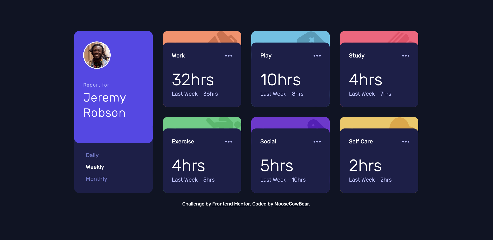

# Frontend Mentor - Time tracking dashboard solution

This is a solution to the [Time tracking dashboard challenge on Frontend Mentor](https://www.frontendmentor.io/challenges/time-tracking-dashboard-UIQ7167Jw).

## The challenge

Users should be able to:

- View the optimal layout for the site depending on their device's screen size
- See hover states for all interactive elements on the page
- Switch between viewing Daily, Weekly, and Monthly stats

## Screenshot

## Links

- [Solution](https://github.com/MooseCowBear/frontend-mentor-time-tracking-dashboard)
- [Live](https://moosecowbear.github.io/frontend-mentor-time-tracking-dashboard/)

## Built with

- Semantic HTML5 markup
- CSS custom properties
- Flexbox
- CSS Grid

## Helpful Resource

- This [post](https://kellegous.com/j/2013/02/27/innertext-vs-textcontent/) on the difference between innerText and innerContent.

## Author

- GitHub - [MooseCowBear](https://github.com/MooseCowBear)
- Frontend Mentor - [@MooseCowBear](https://www.frontendmentor.io/profile/MooseCowBear)